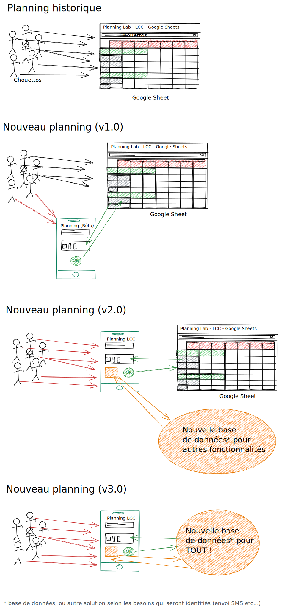

# Le planning de La Chouette Coop

[](http://commitizen.github.io/cz-cli/)

**PROTOTYPE** Cette application est encore au stade de prototypage, avant de
pouvoir être utilisée sereinement à plus grande échelle.

Cette application vise à proposer un espace unique et convivial pour se positionner sur le planning de La Chouette Coop. Elle permet d'avoir une vue d'ensemble et de pouvoir gérer sa participation au projet.

## Documentation

Pas encore `¯\_(ツ)_/¯`

## Présentation

Pas encore `¯\_(ツ)_/¯`

## Aperçu technique

Cette application est une application Javascript, utilisant la librairie [React](https://fr.reactjs.org/). C'est une application cliente uniquement, mais les informations sont stockées par ailleurs. Elle interagit avec [l'API de La Chouette Coop](https://github.com/lachouettecoop/api/) pour la récupération des données et modifications.

Voici quelques illustrations de l'architecture globale du système applicatif du planning et des étapes du projet :

- historiquement, les Chouettos utilisent une Google Sheet
- en v1.0 une cohabitation sera possible : certain·e·s pourront bêta-tester le nouveau planning, qui sera compatible avec la Google Sheet
- en v2.0, seule cette application sera utilisable : la Google Sheet restera privée (ou en lecture seule) mais toujours utilisée techniquement. Une nouvelle base commencera à émerger pour combler de nouveaux besoins
- en v3.0 seule cette application sera utilisée, la Google Sheet actuelle sera supprimée au dépend de la nouvelle base de données



## Installation

- `npm install`

**À NOTER :** par défaut, le fichier `.env` (utilisé pour configurer l'application) contient les adresses de l'API de **production**. Si vous souhaitez utiliser d'autres instances des services liés, vous pouvez [créer un fichier `.env.local` avec vos surcharges (cf documentation de `create-react-app`)](https://create-react-app.dev/docs/adding-custom-environment-variables/#what-other-env-files-can-be-used).

## Lancement

- En mode développeur : `npm run start`
- En production : avec docker (lancement de l'image construite au déploiement)

## Tests

Les tests automatisés se lancent avec la commande : `npm run test`

## Contribution

Nous suivons la convention https://www.conventionalcommits.org/ pour les
messages de commits, afin de permettre une publication simple des nouvelles
versions et des changelogs. Nous pensons que cela facilite le suivi du projet et
sa maintenance/reprise sur le long terme.

**Cela n’est pas très compliqué !** Au lieu de faire `git commit`, exécutez
`npm run commit` et laissez-vous guider !

## Release

- `GITHUB_TOKEN="xxxxxx" npm run release`

Vous pouvez ajouter le suffixe `-- -n` à la commande pour une release
entièrement automatisée, si vous osez !

## Déploiement

Une image Docker (`lachouettecoop/planning`) est construite à chaque nouveau changement ou nouvelle version (via les Actions Github décrites dans le dossier
`.github/workflows` du dépôt).

La branche `master` est disponible via le tag `latest`, et les tags (versions) via leurs tags respectifs.

Il est donc possible de lancer l'application en mode production grâce à Docker.
Le port `4000` est exposé, et il faut rendre disponible les variables d'environnement
contenant les secrets / configurations dans le conteneur (voir [la section d'installation](#installation)).

### Commande Docker

Par exemple, la commande Docker pour lancer l'application serait :

`docker run --rm -P lachouettecoop/planning:latest`

Regardez ensuite le port de votre machine sur lequel a été mappé le port `8043` du
conteneur grâce à la commande `docker ps` et accédez à http://0.0.0.0:32768/
(en remplaçant par le numéro de port correct).

### Fichier Docker Compose

Pour une utilisation en production, voici un exemple de fichier `docker-compose.yml`
avec une configuration Traæfik.

```yml
version: "2.1"

services:
  web:
    image: lachouettecoop/planning:latest
    restart: unless-stopped
    networks:
      default:
      inverseproxy_shared:
    labels:
      traefik.docker.network: "inverseproxy_shared"
      traefik.enable: "true"
      traefik.frontend.passHostHeader: "true"
      traefik.port: "8043"
      traefik.frontend.rule: "Host:planning.lachouettecoop.test"

networks:
  default:
    internal: true
    driver_opts:
      encrypted: 1
  inverseproxy_shared:
    external: true
```
